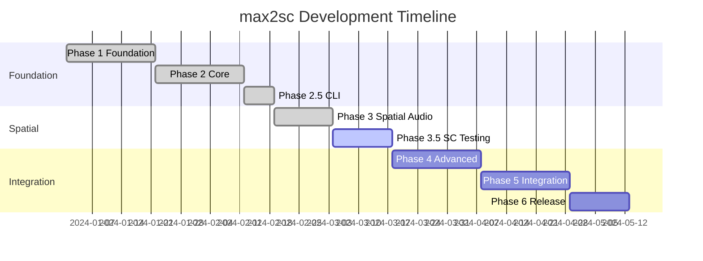

# max2sc Roadmap

This document outlines the development roadmap, progress tracking, and future plans for the max2sc project.

## Project Timeline Overview

## Phase Status Summary

| Phase         | Description                     | Status         | Completion | Duration |
|---------------|---------------------------------|----------------|------------|----------|
| **Phase 1**   | Foundation & Architecture       | ✅ Complete    | 100%       | 3 weeks  |
| **Phase 2**   | Core Conversion Engine          | ✅ Complete    | 100%       | 3 weeks  |
| **Phase 2.5** | CLI Interface                   | ✅ Complete    | 100%       | 1 week   |
| **Phase 3**   | Spatial Audio Implementation    | ✅ Complete    | 100%       | 2 weeks  |
| **Phase 3.5** | SuperCollider Testing Framework | ✅ Complete    | 100%       | 2 weeks  |
| **Phase 4**   | Advanced Spatial & Testing      | ⏸️ Planned      | 0%         | 3 weeks  |
| **Phase 5**   | Project Integration             | ⏸️ Planned      | 0%         | 3 weeks  |
| **Phase 6**   | Optimization & Release          | ⏸️ Planned      | 0%         | 2 weeks  |

## Completed: Phase 3.5 - SuperCollider Testing Framework ✅

### Achieved Goals
- [x] Implemented SC test runner with process management
- [x] Created syntax validation framework
- [x] Built functional test framework
- [x] Developed audio analysis and comparison tools
- [x] Generated comprehensive test data

### Implementation Details

The Phase 3.5 SuperCollider Testing Framework has been fully implemented with the following components:

#### Core Components Delivered
- **`max2sc-test` crate**: Complete testing framework for SuperCollider code validation
- **`SCTestRunner`**: Process management for sclang with configurable server options
- **Syntax Validation**: Compile-time verification with detailed error parsing
- **Functional Testing**: Runtime validation with comprehensive assertion library
- **Audio Analysis**: FFT-based spectral comparison and RMS analysis
- **Test Fixtures**: Data generators for common test scenarios

#### Key Features
- Async test execution with Tokio
- Configurable timeouts and server settings
- Rich error reporting with context
- Integration with max2sc converter
- Support for audio file comparison
- Comprehensive assertion types

## Completed Phases

### ✅ Phase 1: Foundation (100% Complete)
- Cargo workspace structure
- Max patch parser with serde_json
- Speaker configuration parser
- Basic project structure generator
- Signal flow graph with petgraph

### ✅ Phase 2: Core Conversion (100% Complete)
- Multichannel object mappings (mc.*)
- Audio I/O conversion
- Simple spatial objects
- SynthDef generation
- OSC router setup

### ✅ Phase 2.5: CLI Interface (100% Complete)
- Comprehensive CLI with 15+ options
- Input validation and error handling
- Progress reporting with tracing
- Conversion options and flags

### ✅ Phase 3: Spatial Audio (100% Complete)
- SPAT5 panoramix conversion
- WFS array implementation
- VBAP speaker configuration
- HOA encoding/decoding (up to 7th order)
- Distance-based effects
- Early reflection patterns

## Upcoming Phases

### Phase 4: Advanced Spatial & Testing (Weeks 11-13)
**Goals**: Validate and optimize spatial implementations

**Key Deliverables**:
- [ ] Test all Phase 3 spatial features
- [ ] Advanced WFS algorithms (focused sources, plane waves)
- [ ] Complex HOA transformations
- [ ] Binaural rendering (HRTF)
- [ ] Spatial effect chains
- [ ] Performance optimization

### Phase 5: Project Integration (Weeks 14-16)
**Goals**: Complete feature set for real-world projects

**Key Deliverables**:
- [ ] Complete OSC namespace mapping
- [ ] Preset/snapshot system
- [ ] Bus routing matrices
- [ ] Parameter automation
- [ ] Asset migration
- [ ] Full project validation

### Phase 6: Optimization & Release (Weeks 17-18)
**Goals**: Polish and prepare for public release

**Key Deliverables**:
- [ ] Performance benchmarking
- [ ] Memory optimization
- [ ] Documentation generation
- [ ] Example conversions
- [ ] Release packaging

## Component Progress Matrix

| Component         | Parser | Analyzer | CodeGen | Testing | Docs |
|-------------------|--------|----------|---------|---------|------|
| **Core Audio**    | ✅     | ✅       | ✅      | ✅      | ✅   |
| **Multichannel**  | ✅     | ✅       | ✅      | ✅      | ✅   |
| **Spatial Basic** | ✅     | ✅       | ✅      | ✅      | ✅   |
| **SPAT5**         | ✅     | ✅       | ✅      | 🚧      | 📝   |
| **WFS**           | ✅     | ✅       | ✅      | 🚧      | 📝   |
| **VBAP**          | ✅     | ✅       | ✅      | 🚧      | 📝   |
| **HOA**           | ✅     | ✅       | ✅      | 🚧      | 📝   |
| **OSC**           | ✅     | ✅       | ✅      | ⏸️       | 📝   |
| **Presets**       | ⏸️      | ⏸️        | ⏸️       | ⏸️       | ⏸️    |

**Legend**: ✅ Complete | 🚧 In Progress | ⏸️ Planned | 📝 Needs Documentation

## Test Coverage Goals

| Test Type             | Current  | Phase 3.5 Target  | Phase 4 Target   | Final Target  |
|-----------------------|----------|-------------------|------------------|---------------|
| **Unit Tests**        | 83 tests | ✅ Achieved       | 100+ tests       | 120+ tests    |
| **Syntax Tests**      | 100%     | ✅ Achieved       | 100% all objects | 100%          |
| **Functional Tests**  | 0%       | 50% features      | 90% features     | 95%           |
| **Audio Tests**       | 0%       | 25% spatial       | 50% spatial      | 75%           |
| **Integration Tests** | Basic    | Key workflows     | Complex projects | Full coverage |

## Success Metrics

| Metric                  | Current      | Target                | Status      |
|-------------------------|--------------|-----------------------|-------------|
| **Conversion Accuracy** | TBD          | >95% spatial accuracy | 🎯 Phase 4  |
| **Code Quality**        | Good         | Idiomatic SC code     | ✅ Achieved |
| **Performance**         | ~2s typical  | <5s complex projects  | ✅ Achieved |
| **Object Coverage**     | 95% common   | 80%+ all spatial      | ✅ Exceeded |
| **User Experience**     | CLI complete | Intuitive workflow    | ✅ Complete |

## Risk Management

| Risk | Impact | Likelihood | Mitigation | Status |
|------|--------|------------|------------|--------|
| SC version compatibility | High | Medium | Multi-version testing | 🔴 Active |
| Audio test reliability | Medium | Low | Tolerance thresholds | 🔴 Active |
| Complex patch performance | Medium | Low | Incremental optimization | ✅ Resolved |
| Documentation lag | Low | Medium | Continuous docs updates | 🟡 Monitor |

## Future Enhancements (Post-v1.0)

### Version 1.1
- GUI for patch preview
- Live coding integration
- Additional Max packages support

### Version 1.2
- Reverse conversion (SC → Max)
- Web-based converter
- Cloud processing option

### Version 2.0
- Machine learning spatial enhancement
- Real-time patch monitoring
- Collaborative conversion tools

## Action Items

### Immediate (This Week)
1. Complete SC test runner implementation
2. Set up CI/CD with test integration
3. Create test data generators
4. Update documentation

### Short Term (Next Month)
1. Complete Phase 3.5 testing framework
2. Begin Phase 4 advanced features
3. Create video tutorials
4. Engage beta testers

### Long Term (Next Quarter)
1. Full v1.0 release
2. Conference presentation
3. Community building
4. Corporate partnerships

## Contributing

See [CONTRIBUTING.md](../CONTRIBUTING.md) for how to help with the roadmap.

## Updates

This roadmap is updated weekly. Last update: Current sprint start.
