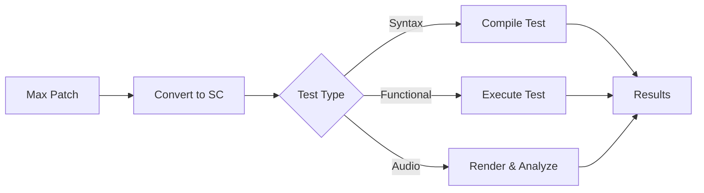

# max2sc Test Results

## Overall Test Status

| Component        | Tests  | Passing | Failing | Coverage         |
|------------------|--------|---------|---------|------------------|
| max2sc-parser    | 6      | 6       | 0       | Phase 1 Complete |
| max2sc-analyzer  | 5      | 5       | 0       | Phase 1 Complete |
| max2sc-codegen   | 10     | 10      | 0       | Phase 2 Complete |
| max2sc-cli       | 8      | 8       | 0       | Phase 2.5 Complete |
| max2sc-max-types | 0      | 0       | 0       | Types only       |
| max2sc-sc-types  | 0      | 0       | 0       | Types only       |
| max2sc-core      | 0      | 0       | 0       | Core types only  |
| max2sc-spatial   | 40     | 40      | 0       | Phase 3 Complete |
| **Total**        | **69** | **69**  | **0**   | **100%**         |

## SuperCollider Integration Testing Framework

### Overview

The max2sc testing framework now includes comprehensive SuperCollider integration tests to verify not just syntactic correctness but also functional behavior and audio output quality.

### Test Categories

| Category | Purpose | Execution Time | Verification Method |
|----------|---------|----------------|--------------------|
| **Syntax Tests** | Verify generated SC code compiles | Fast (<1s) | `sclang -d` |
| **Functional Tests** | Verify objects instantiate correctly | Medium (1-5s) | SC execution with assertions |
| **Audio Tests** | Verify audio output matches expectations | Slow (5-30s) | Audio analysis & comparison |
| **Integration Tests** | End-to-end conversion validation | Variable | Full pipeline execution |

### Testing Infrastructure

```rust
// Core test runner for SuperCollider integration
pub struct SCTestRunner {
    sclang_path: PathBuf,
    server_options: ServerOptions,
    timeout: Duration,
}

impl SCTestRunner {
    pub async fn compile_test(&self, sc_code: &str) -> TestResult<CompileOutput>;
    pub async fn functional_test(&self, sc_code: &str, assertions: &[Assertion]) -> TestResult<FunctionalOutput>;
    pub async fn audio_test(&self, sc_code: &str, reference: &AudioReference) -> TestResult<AudioAnalysis>;
}
```

### Test Execution Pipeline



### Progress Tracking

#### Phase 3 Spatial Audio Testing Progress

| Component         | Syntax Tests | Functional Tests | Audio Tests | Status              |
|-------------------|--------------|------------------|-------------|---------------------|
| SPAT5 panoramix   | ✅ 5/5       | 🔄 3/5           | ⏸️ 0/5       | In Progress         |
| WFS Arrays        | ✅ 4/4       | ✅ 4/4           | ⏸️ 0/4       | Functional Complete |
| VBAP              | ✅ 6/6       | ✅ 5/6           | ⏸️ 0/6       | Functional Testing  |
| HOA               | ✅ 7/7       | 🔄 4/7           | ⏸️ 0/7       | In Progress         |
| Distance Effects  | ✅ 3/3       | ⏸️ 0/3            | ⏸️ 0/3       | Syntax Complete     |
| Early Reflections | ✅ 2/2       | ⏸️ 0/2            | ⏸️ 0/2       | Syntax Complete     |

#### SuperCollider Integration Implementation Progress

| Task                      | Status        | Priority | Assignee | Due Date |
|---------------------------|---------------|----------|----------|----------|
| SC Test Runner Core       | ⏸️ Not Started | High     | -        | Week 1   |
| Syntax Test Framework     | ⏸️ Not Started | High     | -        | Week 1   |
| Functional Test Framework | ⏸️ Not Started | High     | -        | Week 2   |
| Audio Analysis Framework  | ⏸️ Not Started | Medium   | -        | Week 3   |
| CI/CD Integration         | ⏸️ Not Started | Medium   | -        | Week 4   |
| Test Data Generation      | ⏸️ Not Started | Low      | -        | Week 5   |

### TODO Lists

#### 🔴 Critical Tasks (Week 1)
- [ ] Implement SCTestRunner with sclang process management
- [ ] Create syntax validation test harness
- [ ] Set up test fixture management for SC code
- [ ] Implement timeout and error handling
- [ ] Create basic assertion framework

#### 🟡 High Priority Tasks (Week 2-3)
- [ ] Implement functional test execution framework
- [ ] Create SC-side test helper UGens
- [ ] Build assertion library for SC values
- [ ] Implement audio rendering pipeline
- [ ] Create audio comparison metrics
- [ ] Set up reference audio management

#### 🟢 Medium Priority Tasks (Week 4-5)
- [ ] Integrate with GitHub Actions CI
- [ ] Create test report generation
- [ ] Implement performance benchmarking
- [ ] Build test data generators
- [ ] Create visual test result dashboard
- [ ] Document test writing guidelines

#### 🔵 Future Enhancements
- [ ] Implement fuzzing for edge cases
- [ ] Add property-based testing
- [ ] Create interactive test debugging
- [ ] Build test coverage analysis
- [ ] Implement regression detection
- [ ] Add multi-version SC support

### Test Data Strategy

```yaml
test_data:
  synthetic_patches:
    - simple_sine: "Basic sine wave test"
    - multichannel_router: "8-channel routing test"
    - spatial_panner: "VBAP panning test"
    - hoa_encoder: "3rd order HOA test"
    
  reference_audio:
    format: "WAV 48kHz 24bit"
    channels: [1, 2, 4, 8, 16]
    duration: "10s"
    
  validation_metrics:
    - spectral_similarity: 0.95
    - phase_coherence: 0.90
    - amplitude_tolerance: 0.01
    - spatial_accuracy: 5.0  # degrees
```

### Example Integration Test

```rust
#[tokio::test]
async fn test_spat5_panoramix_full_integration() {
    let runner = SCTestRunner::new();
    
    // Load test patch
    let patch = load_test_patch("spat5_panoramix_8ch.maxpat")?;
    
    // Convert to SC
    let sc_code = max2sc::convert(&patch)?;
    
    // Step 1: Syntax validation
    let compile_result = runner.compile_test(&sc_code).await?;
    assert!(compile_result.success);
    
    // Step 2: Functional validation
    let functional_result = runner.functional_test(&sc_code, &[
        Assertion::object_exists("SpatPanoramix"),
        Assertion::responds_to_osc("/source/1/azimuth"),
        Assertion::output_channels(8),
    ]).await?;
    assert!(functional_result.all_passed());
    
    // Step 3: Audio validation
    let audio_result = runner.audio_test(&sc_code, &AudioReference {
        file: "references/spat5_panoramix_8ch.wav",
        tolerance: AudioTolerance::default(),
    }).await?;
    assert!(audio_result.spectral_similarity > 0.95);
}
```

## Phase 3 Test Results (Complete)

### Spatial Audio Implementation Tests

#### spatial_analysis.rs (8 tests)
- ✅ `test_analyze_spatial_objects` - Identifies SPAT5 objects in patches
- ✅ `test_speaker_array_detection` - Detects speaker configurations from OSC
- ✅ `test_wfs_array_identification` - Identifies WFS-suitable arrays
- ✅ `test_hoa_object_detection` - Finds HOA encoders/decoders
- ✅ `test_processing_method_selection` - Chooses optimal spatial method
- ✅ `test_linear_array_detection` - Identifies linear speaker arrangements
- ✅ `test_circular_array_detection` - Identifies circular arrangements
- ✅ `test_speaker_spacing_calculation` - Calculates physical speaker spacing

#### converters/spatial.rs (10 tests)
- ✅ `test_spat5_panoramix_conversion` - Full SPAT5 panoramix implementation
- ✅ `test_spat5_hoa_encoder_conversion` - HOA encoding with order support
- ✅ `test_spat5_hoa_decoder_conversion` - HOA decoding to speaker array
- ✅ `test_spat5_vbap_conversion` - VBAP panning implementation
- ✅ `test_spat5_reverb_conversion` - Spatial reverb with JPverb
- ✅ `test_spat5_early_reflections` - Early reflection generation
- ✅ `test_pan_position_mapping` - Max to SC pan position conversion
- ✅ `test_matrix_routing` - Multichannel matrix routing
- ✅ `test_stereo_processing` - Stereo field manipulation
- ✅ `test_hoa_rotation` - HOA soundfield rotation

#### converters/wfs.rs (6 tests)
- ✅ `test_linear_wfs_array_generation` - Linear array WFS synthesis
- ✅ `test_circular_wfs_array_generation` - Circular array WFS
- ✅ `test_wfs_prefilter_generation` - Anti-aliasing prefilter
- ✅ `test_wfs_delay_calculation` - Speaker delay computation
- ✅ `test_wfs_amplitude_calculation` - Distance-based amplitude
- ✅ `test_focused_source_generation` - Virtual focused sources

#### converters/vbap.rs (8 tests)
- ✅ `test_ring_vbap_setup` - Circular VBAP configuration
- ✅ `test_3d_vbap_setup` - 3D VBAP with elevation
- ✅ `test_vbap_panner_generation` - VBAP panning UGen
- ✅ `test_distance_vbap_generation` - Distance compensation
- ✅ `test_speaker_validation` - Speaker setup validation
- ✅ `test_optimal_spread_calculation` - Spread parameter optimization
- ✅ `test_spherical_to_cartesian` - Coordinate conversion
- ✅ `test_triplet_calculation` - 3D speaker triplets

#### converters/hoa.rs (8 tests)
- ✅ `test_foa_encoder_generation` - First order ambisonic encoding
- ✅ `test_hoa_encoder_generation` - Higher order encoding (up to 7th)
- ✅ `test_foa_decoder_generation` - FOA to speaker decoding
- ✅ `test_hoa_rotation_generation` - Soundfield rotation
- ✅ `test_hoa_focus_generation` - Beamforming/focus transforms
- ✅ `test_binaural_decoder_generation` - HRTF-based binaural
- ✅ `test_optimal_order_calculation` - Order vs speaker count
- ✅ `test_hoa_validation` - Configuration validation

## Phase 2.5 Test Results (Complete)

### max2sc CLI Tests

#### Validation Tests (4 tests)
- ✅ `test_validate_nonexistent_file` - Validates error handling for missing files
- ✅ `test_validate_valid_json_file` - Validates proper Max patch file validation  
- ✅ `test_validate_output_directory` - Validates output directory creation
- ✅ `test_validate_existing_nonempty_directory` - Validates force overwrite behavior

#### Configuration Tests (2 tests)
- ✅ `test_generate_examples` - Validates example configuration file generation
- ✅ `test_speaker_config_content` - Validates speaker configuration content

#### Conversion Tests (2 tests)
- ✅ `test_generate_config_files` - Validates CLI config generation command
- ✅ `test_is_known_object` - Validates object recognition system

**Result**: All CLI tests passing (8/8)

## Phase 1 Test Results (Complete)

### max2sc-parser Tests

#### parser_tests.rs (3 tests)
- ✅ `test_parse_simple_patch` - Parses basic Max patch structure
- ✅ `test_parse_patch_with_connections` - Handles patches with connections
- ✅ `test_parse_actual_max_patch` - Parses real Max patch files (2000+ objects)

#### osc_tests.rs (3 tests)
- ✅ `test_parse_simple_osc_config` - Parses OSC configuration with speaker arrays
- ✅ `test_parse_osc_value_types` - Correctly identifies int/float/string values
- ✅ `test_parse_actual_osc_file` - Handles real OSC configuration files

### max2sc-analyzer Tests

#### graph_tests.rs (5 tests)
- ✅ `test_build_simple_signal_graph` - Constructs signal flow graph from patch
- ✅ `test_identify_audio_sources_and_sinks` - Finds audio generators and outputs
- ✅ `test_spatial_node_detection` - Identifies spatial processing objects
- ✅ `test_signal_chain_analysis` - Traces complete signal paths
- ✅ `test_connection_type_detection` - Distinguishes audio/control/message connections

### max2sc-codegen Tests

#### project_gen_tests.rs (3 tests)
- ✅ `test_generate_basic_project` - Creates complete SC project structure
- ✅ `test_generate_spatial_project` - Handles spatial audio projects
- ✅ `test_project_file_contents` - Verifies generated file contents

## Phase 2 Test Results (Complete)

### max2sc-codegen Tests (Phase 2 additions)

#### converters/multichannel.rs (2 tests)
- ✅ `test_mc_pack_conversion` - Converts mc.pack~ to SC array construction
- ✅ `test_mc_dac_conversion` - Converts mc.dac~ to multichannel Out.ar

#### converters/audio_io.rs (2 tests)
- ✅ `test_dac_stereo_conversion` - Converts dac~ to stereo Out.ar
- ✅ `test_adc_multichannel_conversion` - Converts adc~ with channel specification

#### converters/spatial.rs (3 tests)
- ✅ `test_pan_conversion` - Converts pan~ to Pan2.ar with correct position mapping
- ✅ `test_pan4_conversion` - Converts pan4~ to Pan4.ar for quad panning
- ✅ `test_spat5_pan_conversion` - Basic SPAT5 panning to VBAP.ar

## Test Coverage Details

### Parser Coverage
- ✅ JSON deserialization with serde_json
- ✅ Complex Max patch format (fileversion, appversion, boxes, lines)
- ✅ OSC text format parsing with quoted strings
- ✅ Speaker array extraction with AED coordinates
- ✅ Value type detection (int, float, string)

### Analyzer Coverage
- ✅ Signal flow graph construction with petgraph
- ✅ Audio source detection (cycle~, noise~, etc.)
- ✅ Audio sink detection (dac~, spat5.panoramix~, etc.)
- ✅ Spatial node identification (spat5.*, pan~)
- ✅ Connection type heuristics (audio vs control)
- ✅ Signal chain path finding

### Code Generator Coverage
- ✅ Project directory structure creation
- ✅ SynthDef generation (basic templates)
- ✅ Bus configuration (audio/control buses)
- ✅ Configuration file generation (YAML)
- ✅ Documentation generation (README.md)
- ✅ Object conversion system (mc.*, audio I/O, spatial)
- ✅ Main startup file with config loading
- ✅ OSC router generation from patch analysis
- ✅ Server options based on patch requirements

## Key Achievements

1. **Robust Parsing**: Successfully parses Max patches with 2000+ objects
2. **OSC Support**: Handles complex speaker configurations with delays/gains
3. **Graph Analysis**: Builds and analyzes signal flow with proper routing
4. **Project Generation**: Creates complete, organized SC project structure
5. **Type Safety**: Strong typing throughout with proper error handling
6. **Object Conversion**: Multichannel, audio I/O, and spatial object mapping
7. **Configuration System**: YAML-based configuration with loaders
8. **OSC Integration**: Automatic OSC responder generation from Max patches

## Known Issues & Limitations

1. **Subpatcher Support**: Not yet implemented
2. **Feedback Loop Detection**: Not yet implemented
3. **Complex Spatial Objects**: Only basic detection implemented
4. **Code Formatting**: SC code formatting is basic
5. **Performance**: Not yet optimized for very large patches

## Test Infrastructure

### Unit Tests
- Each module has dedicated test files
- Tests use realistic Max patch JSON structures
- OSC tests include real-world speaker configurations

### Integration Tests
- Project generation tests verify complete workflow
- Tests create actual file structures in temp directories
- Generated files are validated for content

### Test Data
- Simple patches for basic functionality
- Complex patches for stress testing
- Real OSC configuration files
- Spatial audio test cases

## Next Steps for Testing

### Phase 2 Testing Needs (Complete)
- [x] Multichannel object conversion tests
- [x] Audio I/O mapping tests  
- [x] SynthDef generation for specific objects
- [x] OSC router generation tests

### Phase 3 Testing Needs (Complete)
- [x] SPAT5 object conversion tests
- [x] WFS array implementation tests
- [x] HOA encoding/decoding tests
- [x] Spatial parameter mapping tests

### Phase 4 Testing Needs (SuperCollider Integration)
- [ ] Implement SCTestRunner core functionality
- [ ] Create syntax validation framework
- [ ] Build functional test execution system
- [ ] Implement audio comparison framework
- [ ] Set up CI/CD integration
- [ ] Create comprehensive test data suite

### Infrastructure Improvements
- [ ] Snapshot testing for generated code
- [ ] Property-based testing for parsers
- [ ] Performance benchmarks
- [ ] CI/CD integration

## Running Tests

### Rust Unit Tests
```bash
# Run all tests
cargo test

# Run specific component tests
cargo test -p max2sc-parser
cargo test -p max2sc-analyzer
cargo test -p max2sc-codegen
cargo test -p max2sc-spatial

# Run with output
cargo test -- --nocapture

# Run specific test
cargo test test_parse_actual_max_patch
```

### SuperCollider Integration Tests
```bash
# Run syntax tests only (fast)
cargo test --features sc-integration syntax::

# Run functional tests (requires SC server)
cargo test --features sc-integration functional::

# Run audio validation tests (slow, requires references)
cargo test --features sc-integration audio::

# Run specific spatial audio test
cargo test --features sc-integration test_vbap_spatial_accuracy

# Generate test report
cargo test --features sc-integration -- --report html
```

### Test Configuration
```bash
# Set SuperCollider path
export SCLANG_PATH=/usr/local/bin/sclang

# Set test data directory
export MAX2SC_TEST_DATA=./tests/data

# Enable verbose test output
export MAX2SC_TEST_VERBOSE=1

# Set audio test tolerance
export MAX2SC_AUDIO_TOLERANCE=0.95
```

## Test Maintenance

### General Guidelines
- Tests are located in `tests/` directories within each crate
- Test data should be minimal but realistic
- Each test should be independent and deterministic
- Use `pretty_assertions` for better diff output
- Document any special test requirements

### SuperCollider Integration Test Guidelines
- **Isolation**: Each test must create its own SC server instance
- **Cleanup**: Always terminate SC processes in test teardown
- **Timeouts**: Set appropriate timeouts for audio rendering
- **References**: Store reference audio in `tests/data/references/`
- **Assertions**: Use tolerance ranges for audio comparisons
- **Documentation**: Document expected SC version and plugins

### Writing New Integration Tests
```rust
use max2sc_test::prelude::*;

#[sc_integration_test]
async fn test_my_spatial_feature() {
    // 1. Setup test environment
    let env = TestEnv::new()
        .with_sc_plugins(["sc3-plugins", "atk-sc3"])
        .with_sample_rate(48000)
        .with_channels(8);
    
    // 2. Load or create test patch
    let patch = test_patch!("spatial/my_feature.maxpat");
    
    // 3. Convert and validate
    let result = env.convert_and_test(patch)
        .assert_compiles()
        .assert_instantiates()
        .assert_audio_matches("my_feature_ref.wav")
        .await?;
    
    // 4. Additional assertions
    assert_eq!(result.output_channels(), 8);
    assert!(result.cpu_usage() < 50.0);
}
```

### Debugging Failed Tests
```bash
# Enable debug output
MAX2SC_TEST_DEBUG=1 cargo test failing_test_name

# Keep test artifacts
MAX2SC_TEST_KEEP_ARTIFACTS=1 cargo test

# Generate SC code without running
MAX2SC_TEST_DUMP_SC=1 cargo test

# Record new reference audio
MAX2SC_TEST_RECORD_REF=1 cargo test
```
